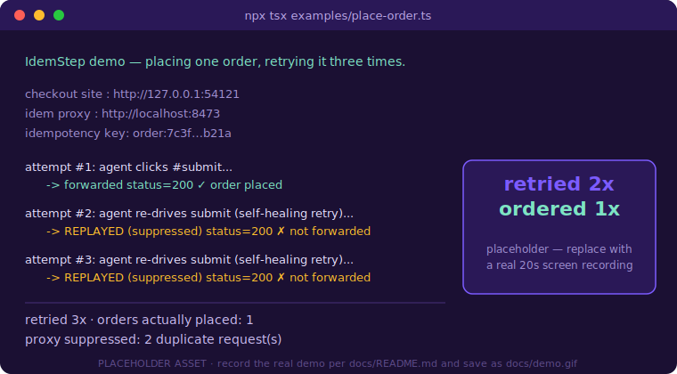

<p align="center">
  
</p>

<p align="center">
  <em>The idempotency-key layer that makes browser-Agent retries place an order exactly once.</em>
</p>

<p align="center">
  <a href="./LICENSE"></a>
  
  <a href="./.github/workflows/ci.yml"></a>
  = 20" />
  
  
</p>

<p align="center">
  <strong>English</strong> | <a href="./README.zh-CN.md">简体中文</a>
</p>

> **Your browser Agent's self-healing retry re-clicks "place order" after a slow-but-successful submit — and charges the card twice. IdemStep wraps that step with a client-generated key so the retry is deduplicated instead of duplicated.**

## Contents

- [Why this exists](#why-this-exists)
- [Install &amp; Quickstart](#install--quickstart)
- [Demo](#demo)
- [How it works](#how-it-works)
- [vs browser-use self-healing retry](#vs-browser-use-self-healing-retry)
- [API](#api)
- [Pricing](#pricing)
- [Roadmap](#roadmap)
- [License &amp; Contributing](#license--contributing)

## Why this exists

Self-healing browser harnesses re-drive any action that *looks* failed — which is exactly what makes flaky web automation usable. But a retry fired after a slow-but-successful submit has no notion of idempotency, so the booking, checkout, or account-creation happens twice. The pattern is spreading fast: [browser-use/browser-use](https://github.com/browser-use/browser-use) (98k★) is the runtime trusted with more and more write actions, and its self-healing layer grows at hundreds of stars a day. Payments solved this years ago with Stripe's `Idempotency-Key` — a stable, client-minted token that lets the receiver recognize "this is a retry, not a new request." IdemStep transplants that primitive into the browser layer: wrap a transactional step in a key, route the browser through a local proxy, and a re-driven submit becomes a no-op at the network boundary. It is the safety belt the agent-builder crowd ([affaan-m/ECC](https://github.com/affaan-m/ECC) and the broader reliability orbit) has needed since the day self-healing retries started touching real-money flows.

## Install &amp; Quickstart

From a cold clone to your first "exactly-once" proof in three steps:

```bash
npm install idemstep playwright   # 1. install (playwright is a peer dep)
npx idemstep proxy                # 2. start the local dedup proxy (prints a port)
npx tsx examples/place-order.ts   # 3. run the demo: retried 3x, ordered 1x
```

Then wrap any transactional step in your own agent script — point Playwright at the proxy and guard the click:

```ts
import { chromium } from "playwright";
import { idemStep, startProxy, generateKey, IDEM_KEY_HEADER } from "idemstep";

// 1. Start the local interception proxy (or run `npx idemstep proxy` separately).
const proxy = await startProxy({ port: 8473 });

// 2. Route the browser through it.
const browser = await chromium.launch({
  proxy: { server: `http://localhost:${proxy.port}` },
});
const page = await (await browser.newContext()).newPage();

// 3. Mint one stable key for this logical action and stamp it on the request.
const orderKey = generateKey("order"); // e.g. derive `order:${cartId}` for cross-restart safety
await page.route("**/checkout", (route) =>
  route.continue({ headers: { ...route.request().headers(), [IDEM_KEY_HEADER]: orderKey } }),
);

// 4. Wrap the side-effecting step. A self-healing retry with the SAME key is a no-op.
await idemStep("place_order", orderKey, () => page.click("#submit"));
await idemStep("place_order", orderKey, () => page.click("#submit")); // retry — suppressed
```

<details>
<summary>sample output of the demo run</summary>

```text
IdemStep demo — placing one order, retrying it three times.

  checkout site  : http://127.0.0.1:54121
  idem proxy     : http://localhost:8473
  idempotency key: order:7c3f…b21a

  attempt #1: agent clicks #submit...
    -> forwarded            status=200
  attempt #2: agent re-drives submit...
    -> REPLAYED (suppressed) status=200
  attempt #3: agent re-drives submit...
    -> REPLAYED (suppressed) status=200

  ──────────────────────────────────────────
  retried 3x  ·  orders actually placed: 1
  proxy suppressed: 2 duplicate request(s)
  ──────────────────────────────────────────

PASS: retried 2x, ordered 1x.
```

</details>

## Demo

<p align="center">
  
</p>

> 📼 The image above is a placeholder. The real 20-second screen recording (`docs/demo.gif`) still needs to be captured — record a terminal/browser split running `npx tsx examples/place-order.ts` per [docs/README.md](./docs/README.md), then drop it in at `docs/demo.gif`.

## How it works

Two processes, no orchestration — a wrapper guards the client-side effect, a proxy guards the network-side duplicate.

```
[ Agent + Playwright ]  --wraps step-->  idemStep()  --records key in-->  [ IdemStore ]
         |                                                                      ^
         | browser traffic via proxy                                           |
         v                                                                      |
[ IdemStep local proxy ]  --checks requestSig against committed keys-----------┘
         |
         v
   [ Real third-party site ]   (duplicate transactional request suppressed; cached response replayed)
```

- **`idemStep(label, key, fn)`** — first call runs `fn`, caches the result, marks the key `committed`. A later call with the same key short-circuits `fn` and replays the cached result.
- **The proxy** — computes a `requestSig` (`method + host + path + body-hash`) for every outbound request carrying an `x-idem-key`. If a `committed` key already owns that signature, it replays the cached response instead of forwarding. The retry never reaches the upstream site.
- **`IdemStore`** — in-memory by default; pass `--store path.json` to the CLI (or `new IdemStore({ filePath })`) so dedup state survives a process restart. Redis/Postgres are out of scope for v0.1.

Honest scope: IdemStep does **not** ask the third-party site to cooperate — it cannot inject a key a site you don't control will honor. It dedups *client-side* by replaying the request you already committed. That is replay-suppression in a proxy you own, not server-side idempotency.

## vs browser-use self-healing retry

Positioning, not bragging — the harness is genuinely better at the thing it is built for.

| Capability | IdemStep | [browser-use](https://github.com/browser-use/browser-use) self-healing |
| --- | :---: | :---: |
| Re-drives a failed-looking action (DOM recovery) | — | ✓ |
| Idempotency key bound to a transactional step | ✓ | — |
| Suppresses a duplicate POST after a slow-but-successful submit | ✓ | — |
| Exactly-once proof on a real checkout flow | ✓ | — |
| Drop-in: one wrapper, no harness replacement | ✓ | n/a |

IdemStep is not a harness and does not compete with one — it is the dedup half that sits *under* your existing self-healing loop. Use both.

## API

| Export | Signature | Purpose |
| --- | --- | --- |
| `idemStep` | `idemStep(label, key, fn, opts?)` | Exactly-once wrapper around a side-effecting step. |
| `startProxy` | `startProxy(opts?) => RunningProxy` | Start the local interception/dedup proxy. |
| `IdemStore` | `new IdemStore({ filePath? })` | The key → `StepRecord` store (in-memory or JSON-file). |
| `generateKey` | `generateKey(prefix?)` | Mint an idempotency key (or derive your own stable one). |
| `requestSignature` | `requestSignature(shape)` | Compute the `method+host+path+body-hash` dedup signature. |
| `setDefaultStore` / `getDefaultStore` | — | Swap the process-wide store `idemStep` uses by default. |
| `IDEM_KEY_HEADER` | `"x-idem-key"` | Header the proxy reads to opt a request into dedup. |

CLI: `idemstep proxy [--port N] [--store path.json]`.

## Pricing

The OSS core — the local proxy and the `idemStep` wrapper — is free and self-hostable forever under MIT. The paid tier is the part that is genuinely hard to run yourself reliably across messy real-world sites.

| Plan | Price | What you get |
| --- | --- | --- |
| **Open Source** | Free | Local in-process proxy + `idemStep` wrapper, in-memory / JSON-file store, all milestones in this repo. |
| **Hosted Proxy — Starter** | **$49 / mo** | One managed dedup endpoint, 10k deduped transactional steps/mo, durable key store. Point `proxy.server` at the hosted URL — zero code change. |
| **Hosted Proxy — Team** | **$199 / mo** | Multiple endpoints, 100k steps/mo, shared key store, retention/audit log of suppressed duplicates. Overage ~$1 / additional 1k steps. |

The hosted dedup proxy is the v0.2 monetization seam: teams running agents on real-money checkout/booking flows pay for managed exactly-once instead of operating the cross-site interception layer themselves. The conversion moment is a one-line swap — point your existing Playwright `proxy.server` at the hosted endpoint, paste an API key, and watch the suppressed-duplicate count climb in the dashboard.

## Roadmap

- [x] **m1** — `idemStep(label, key, fn)` wrapper: same-key re-run short-circuits and replays the cached result.
- [x] **m2** — local interception proxy: a duplicate outbound transactional request under a committed key is suppressed and the original response replayed.
- [x] **m3** — runnable `examples/place-order.ts` proving exactly-once end-to-end ("retried 2x, ordered 1x").
- [ ] **Hosted dedup proxy** — the managed cross-site interception layer (durable store, audit log) as the paid tier.
- [ ] **Auto-detection of side-effecting steps** — POST/submit heuristics so the default path needs zero annotation.
- [ ] **Duplicate-detection / reconcile mode** — post-hoc detection alongside prevention.
- [ ] **More bindings** — Puppeteer, Selenium, native browser-use adapter.

## License &amp; Contributing

Released under the [MIT License](./LICENSE). Issues and pull requests are welcome — open an [issue](https://github.com/SuperMarioYL/idemstep/issues) for a bug or a request, or send a PR.

After pushing, set discoverable repo topics:

```bash
gh repo edit --add-topic idempotency --add-topic browser-automation --add-topic playwright --add-topic agent
```

## Share this

```text
IdemStep — Stripe's Idempotency-Key, but for your browser Agent. Wrap a
transactional step with one key so a self-healing retry is deduplicated,
not duplicated. Retried 2x, ordered 1x. https://github.com/SuperMarioYL/idemstep
```

<p align="center"><sub><a href="./LICENSE">MIT</a> © 2026 SuperMarioYL</sub></p>
