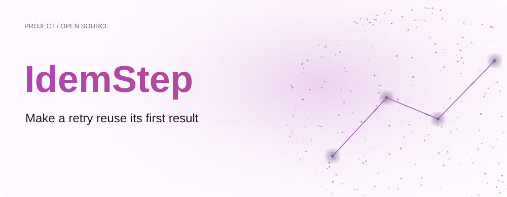
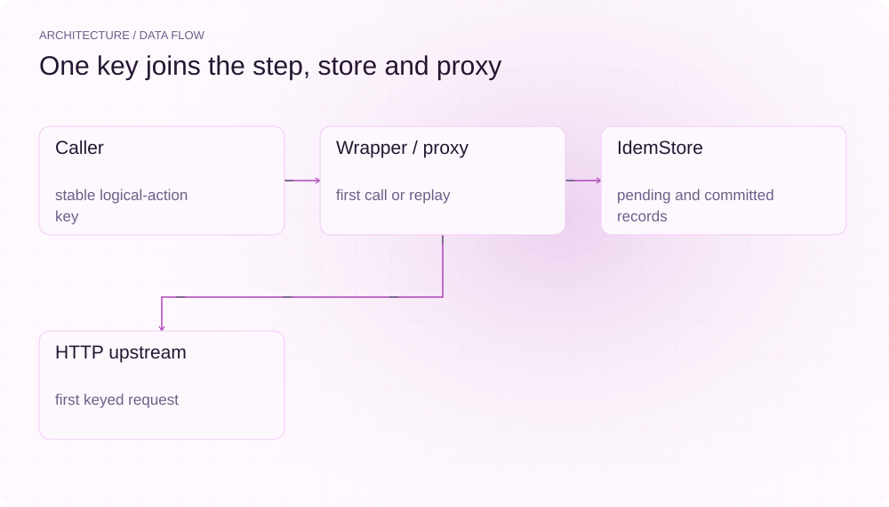
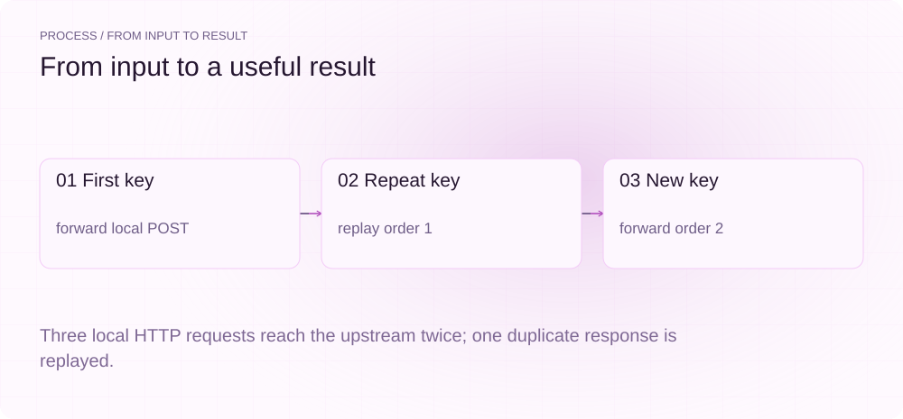
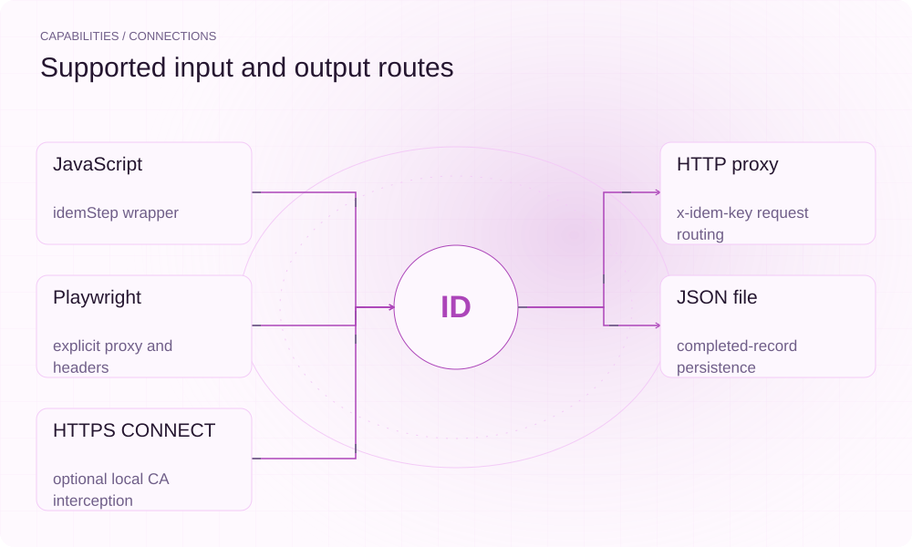

[简体中文](./README.zh-CN.md) · [Website](https://idemstep.lei6393.com) · [GitHub](https://github.com/SuperMarioYL/idemstep)

<picture>
  <source media="(max-width: 600px) and (prefers-color-scheme: dark)" srcset="./assets/presentation/hero-mobile-dark.svg">
  <source media="(max-width: 600px)" srcset="./assets/presentation/hero-mobile-light.svg">
  <source media="(prefers-color-scheme: dark)" srcset="./assets/presentation/hero-dark.svg">
  
</picture>

# IdemStep

**Make a retry reuse its first result**

IdemStep associates an action with a stable key. Its JavaScript wrapper reuses completed step results, and its HTTP proxy replays cached responses for repeated keyed requests.

## Why use it

A slow response can make a browser workflow retry a submit that already completed. Keeping one key for that logical action lets the local store recognize the retry, while a new key explicitly starts a new action.

- **Reuse a result** — Completed keys replay cached wrapper values or HTTP responses.
- **Coalesce concurrent retries** — Same-key callers share an in-flight operation within the process.
- **Choose the retention window** — Use an in-memory store or JSON persistence, with optional committed-key TTL.

## Architecture

<picture>
  <source media="(max-width: 600px) and (prefers-color-scheme: dark)" srcset="./assets/presentation/architecture-mobile-dark.svg">
  <source media="(max-width: 600px)" srcset="./assets/presentation/architecture-mobile-light.svg">
  <source media="(prefers-color-scheme: dark)" srcset="./assets/presentation/architecture-dark.svg">
  
</picture>

idemStep owns the local function lifecycle. IdemStore tracks pending and committed records plus cached values. startProxy reads x-idem-key, forwards the first request, stores the full response and serves later same-key calls from that cache. In-flight maps coalesce concurrent callers; JSON persistence keeps completed records for a restart.

| Component | Responsibility |
| --- | --- |
| `Caller` | stable logical-action key |
| `Wrapper / proxy` | first call or replay |
| `IdemStore` | pending and committed records |
| `HTTP upstream` | first keyed request |

## Install and quickstart

Node.js 20+. The demo uses built-in fetch and a loopback HTTP fixture, so it needs no browser download.

```bash
git clone https://github.com/SuperMarioYL/idemstep.git
cd idemstep
npm ci
npm run build
```

The script starts a real local proxy and a synthetic order endpoint. Two POSTs share order-demo-1; the third uses order-demo-2. It counts actual upstream calls and reads the replay header.

```bash
node examples/presentation-demo.mjs
```

## Recorded demo

<picture>
  <source media="(max-width: 600px) and (prefers-color-scheme: dark)" srcset="./assets/presentation/process-mobile-dark.svg">
  <source media="(max-width: 600px)" srcset="./assets/presentation/process-mobile-light.svg">
  <source media="(prefers-color-scheme: dark)" srcset="./assets/presentation/process-dark.svg">
  
</picture>

Three local HTTP requests reach the upstream twice; one duplicate response is replayed.

```text
{"key":"order-demo-1","status":200,"replayed":false,"body":{"order":1}}
{"key":"order-demo-1","status":200,"replayed":true,"body":{"order":1}}
{"key":"order-demo-2","status":200,"replayed":false,"body":{"order":2}}
upstream calls=2; suppressed retries=1
Scope: local HTTP fixture; no browser, payment provider or external order.
```

The complete command and output are recorded in [docs/demo-results.json](./docs/demo-results.json). Inputs and reproduction code are included in the repository.


The existing recording is retained for context; the text example above documents the reproducible scenario.

## Usage

For the library, import idemStep, generateKey and IdemStore from idemstep. Generate the key once for a logical operation, keep it across retries, and pass the same store to calls that share results. For the proxy, send x-idem-key with the intercepted request; see examples/presentation-demo.mjs for complete HTTP input. A new intent needs a new key even if its body is identical.

```bash
node dist/index.js proxy --host 127.0.0.1 --port 8473 --store ./idemstep-state.json --ttl 86400000 --prune-interval 60000
```

## Configuration

--host 127.0.0.1 keeps the proxy local; omitted host binds all interfaces. --store enables JSON persistence. --ttl expires committed keys, after which the same key may forward again; --prune-interval sweeps expired records. --upstream-timeout bounds idle upstream traffic. --https requires OpenSSL and client trust in the generated CA. Hosted mode adds configurable API-key namespaces but does not provide a distributed transaction store or billing service.

## Integrations and responsibilities

<picture>
  <source media="(max-width: 600px) and (prefers-color-scheme: dark)" srcset="./assets/presentation/integrations-mobile-dark.svg">
  <source media="(max-width: 600px)" srcset="./assets/presentation/integrations-mobile-light.svg">
  <source media="(prefers-color-scheme: dark)" srcset="./assets/presentation/integrations-dark.svg">
  
</picture>

The wrapper and proxy are separate integration points. The wrapper does not automatically attach network headers to a browser request: configure the browser’s proxy and request headers explicitly. HTTP requests without an idempotency key pass through without deduplication.

| Route | Implemented role |
| --- | --- |
| JavaScript | idemStep wrapper |
| HTTP proxy | x-idem-key request routing |
| Playwright | explicit proxy and headers |
| JSON file | completed-record persistence |
| HTTPS CONNECT | optional local CA interception |

## Limits and next steps

- This is local deduplication, not an end-to-end exactly-once guarantee. A crash after an upstream side effect but before durable commit can leave an ambiguous outcome.
- The store is not designed for independently running processes to concurrently share one JSON file.
- The demo covers local HTTP responses; it does not validate browser integration, payment APIs or HTTPS trust setup.

Implemented: wrapper result reuse, HTTP replay, concurrent-call coalescing, JSON persistence, TTL and optional CONNECT interception. Future directions include stronger recovery semantics and distributed storage. Review CHANGELOG.md and store warnings before depending on restart durability.

## License and contributions

See [LICENSE](./LICENSE). When reporting an issue, include a minimal input, the command, and the observed output.
